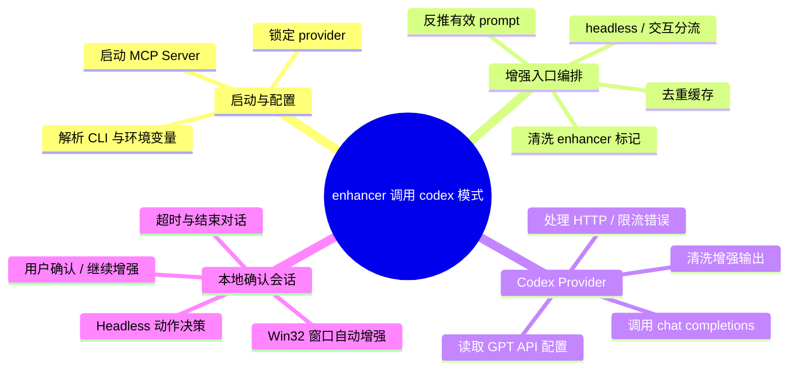

```mermaid
mindmap
  root((enhancer 调用 codex 模式))
    启动与配置
      解析 CLI 与环境变量
      锁定 provider
      启动 MCP Server
    增强入口编排
      清洗 enhancer 标记
      反推有效 prompt
      去重缓存
      headless / 交互分流
    Codex Provider
      读取 GPT API 配置
      调用 chat completions
      处理 HTTP / 限流错误
      清洗增强输出
    本地确认会话
      Headless 动作决策
      Win32 窗口自动增强
      用户确认 / 继续增强
      超时与结束对话
```
